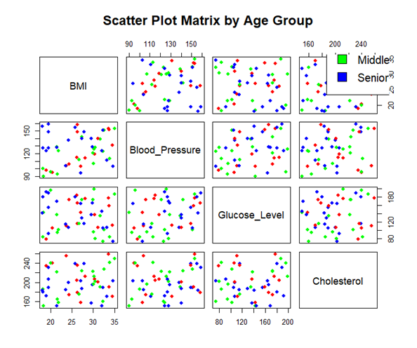
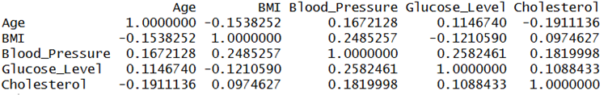

# Experiment 3: Healthcare Data Analysis

**Name:** POOJITH M  
**Roll No:** 23BAD083

## Objective
Perform Exploratory Data Analysis (EDA) on healthcare data to identify correlations between health indicators and visualize relationships using scatter plot matrices with color encoding by age groups.

## Dataset
**File:** `3.healthcare_data.csv`

The dataset contains 52 patient health records with the following attributes:
| Column | Description |
|--------|-------------|
| Patient_ID | Unique identifier for each patient |
| Age | Patient's age |
| Gender | Male/Female |
| BMI | Body Mass Index |
| Blood_Pressure | Blood pressure reading |
| Glucose_Level | Blood glucose level |
| Cholesterol | Cholesterol level |
| Disease_Risk | Risk category (Low, Medium, High) |

## Libraries Used
- Base R graphics

## Analysis Performed

### 1. Age Group Classification
Patients are categorized into three age groups for color encoding:
- 🔴 **Young** - Red
- 🟢 **Middle** - Green
- 🔵 **Senior** - Blue

### 2. Scatter Plot Matrix with Color Encoding
Visualizes relationships between health indicators (BMI, Blood_Pressure, Glucose_Level, Cholesterol) with color-coded age groups.

### 3. Correlation Analysis
Identifies correlated health indicators using a correlation matrix.

## Key Findings
- The correlation matrix reveals relationships between different health indicators
- Age groups show distinct patterns in health metrics
- Scatter plot matrix helps identify potential clusters and outliers

## How to Run
1. Ensure R is installed on your system
2. Update the file path in the script to match your local directory
3. Run `EDA_ass_3.R` in RStudio or R console

## Output
Generated visualizations are saved in the `Figures/` folder.
