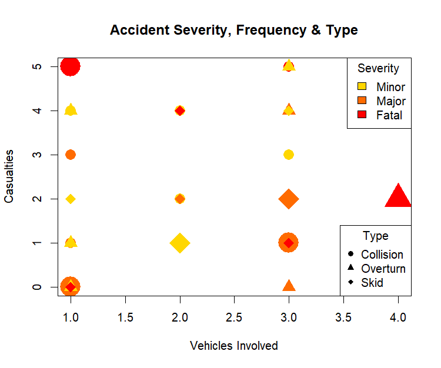

# Experiment 4: Traffic Accidents Analysis

**Name:** POOJITH M  
**Roll No:** 23BAD083

## Objective
Perform Exploratory Data Analysis (EDA) on traffic accident data to visualize accident severity, frequency, and types using multi-dimensional encoding techniques.

## Dataset
**File:** `4.traffic_accidents.csv`

The dataset contains 52 traffic accident records with the following attributes:
| Column | Description |
|--------|-------------|
| Accident_ID | Unique identifier for each accident |
| Location | Location type (Highway, Junction, City Road) |
| Date | Date of accident |
| Time | Time of day (Morning, Afternoon, Evening, Night) |
| Accident_Type | Type of accident (Collision, Overturn, Skid) |
| Severity | Severity level (Minor, Major, Fatal) |
| Vehicles_Involved | Number of vehicles involved |
| Casualties | Number of casualties |

## Libraries Used
- Base R graphics

## Analysis Performed

### Multi-Dimensional Visualization
A scatter plot with multiple visual encodings:

| Visual Element | Data Dimension |
|----------------|----------------|
| **X-axis** | Vehicles Involved |
| **Y-axis** | Casualties |
| **Size** | Accident Frequency |
| **Color Gradient** | Severity (🟡 Gold=Minor → 🔴 Red=Fatal) |
| **Shape** | Accident Type |

### Visualization Output

## Key Findings
- Multi-dimensional encoding allows visualization of 5 variables simultaneously
- Color gradient effectively shows severity progression
- Different shapes help distinguish accident types
- Point size represents frequency of similar accidents

## How to Run
1. Ensure R is installed on your system
2. Update the file path in the script to match your local directory
3. Run `EDA_ass_4.R` in RStudio or R console

## Output
Generated visualizations are saved in the `Figures/` folder.
