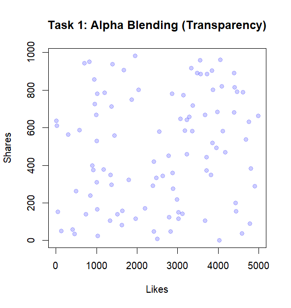
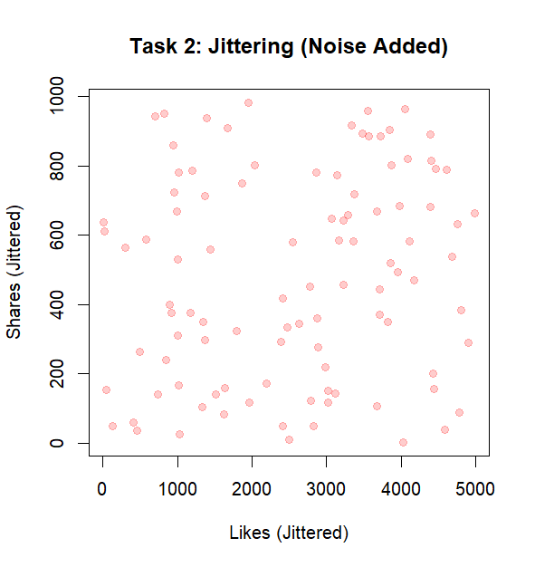
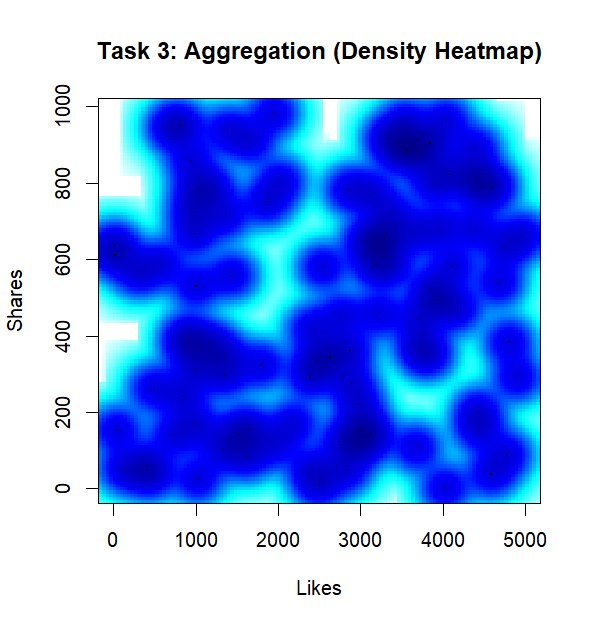

# Experiment 7: Handling Overplotting in Visualization

**Roll No:** 23BAD083

## Objective
Demonstrate techniques to reduce and reveal overplotting in scatterplots using social media interaction data (`Likes` vs `Shares`).

## Dataset
**File:** `7.social_media_interactions.csv`

The dataset contains records of social media engagements with at least the following columns:
| Column | Description |
|--------|-------------|
| Likes | Number of likes for a post |
| Shares | Number of shares for a post |

## Libraries Used
- `ggplot2` - Data visualization
- `scales` - Color and opacity scaling

## Analysis Performed

### 1. Alpha Blending (Transparency)
Adjust point opacity to reveal high-density regions where points overlap.



### 2. Jittering (Noise Addition)
Add small random noise to point coordinates to separate coincident values.



### 3. Aggregation (Density Heatmap)
Use aggregation/smoothing to display local density as a heatmap.



## How to Run
1. Ensure R is installed on your system.
2. Install required packages:
   ```r
   install.packages(c("ggplot2","scales"))
   ```
3. Update the file path in `ex7.R` if needed.
4. Run `ex7.R` in RStudio or R console.

## Output
Generated visualizations are saved in the `figures/` folder.

## Files
- `ex7.R` - R script to reproduce the analysis
- `7.social_media_interactions.csv` - Data file
- `figures/` - Output visualizations
